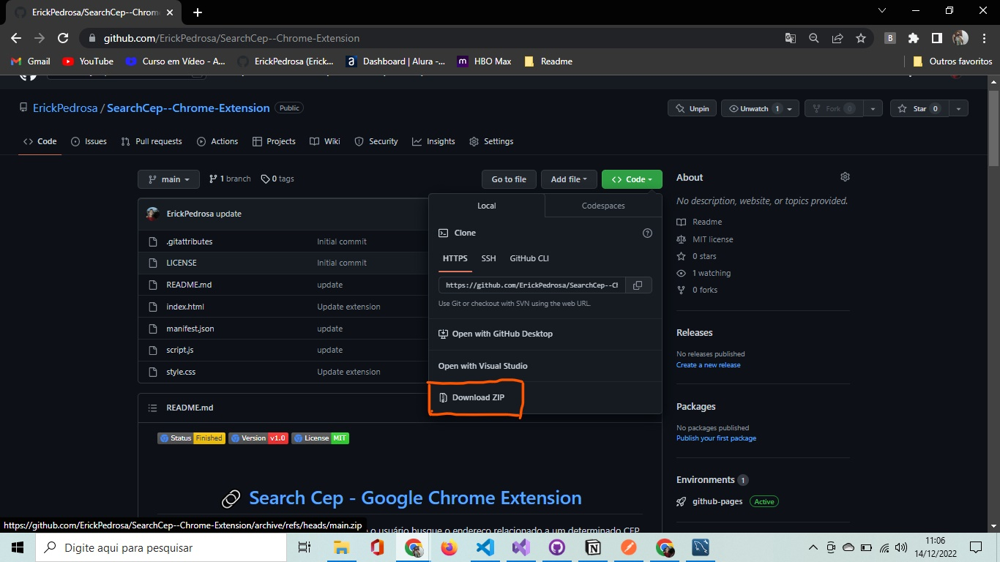
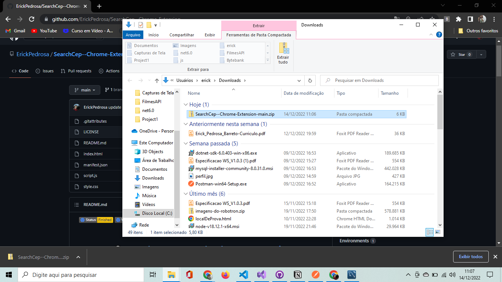
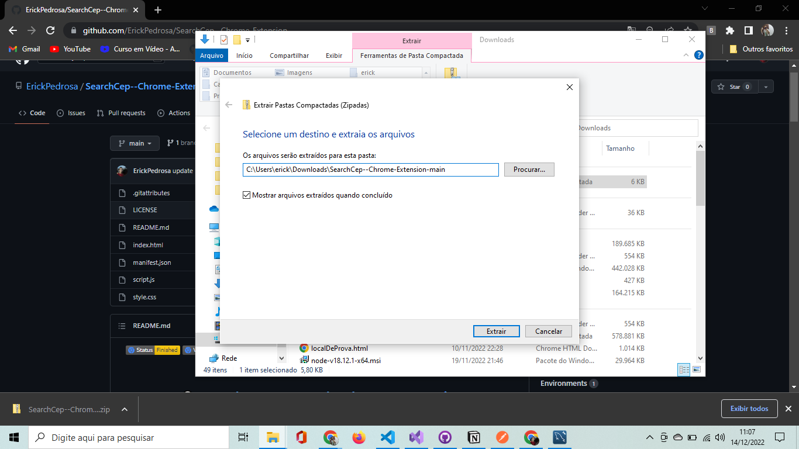
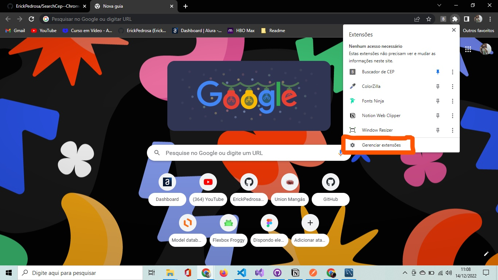
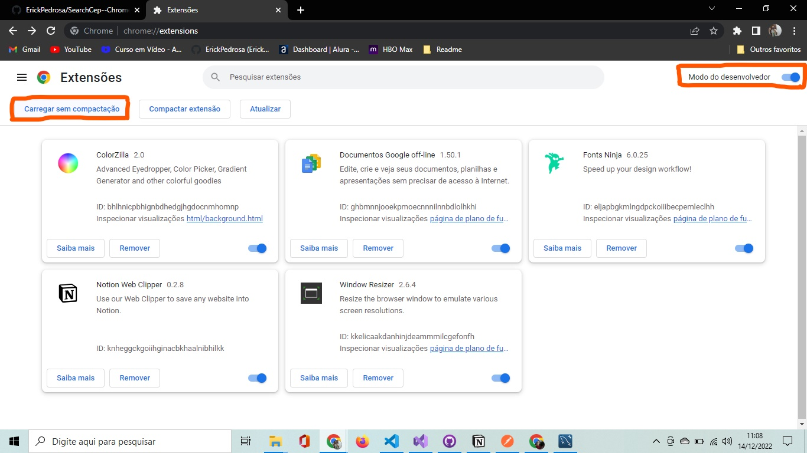
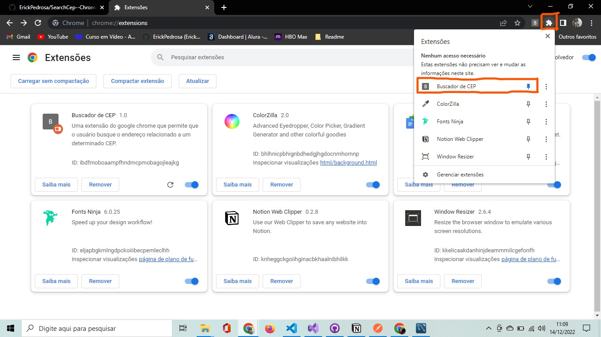
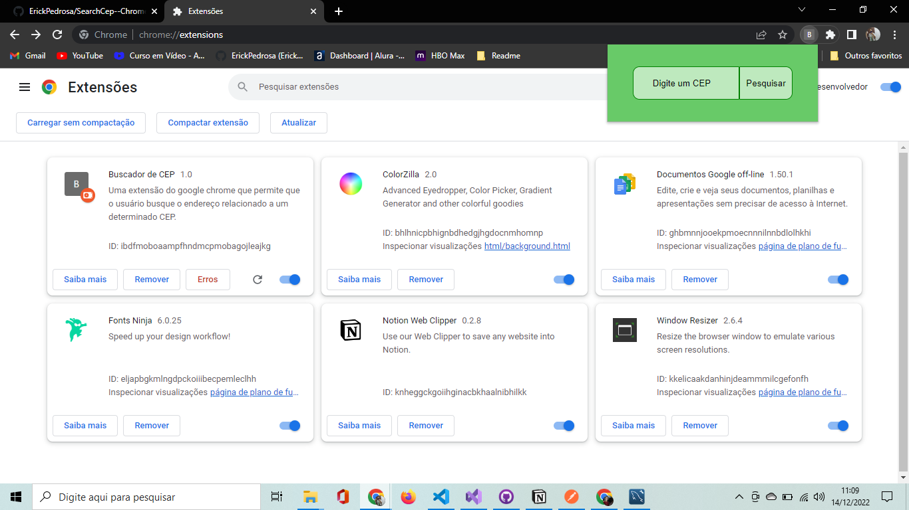

      

 

<h1 align="center">
    <a href="https://erickpedrosa.github.io/SearchCep--Chrome-Extension/">🔗 Search Cep - Google Chrome Extension</a>
</h1>

Uma extensão do google chrome que permite que o usuário busque o endereço relacionado a um determinado CEP.
    

 
 

 <a href="#objetivo">Objetivo</a> •
 <a href="#desenvolvimento">Desenvolvimento</a> •
 <a href="#status">Status do Projeto</a> •
 <a href="#status">Pré-requisitos</a> •
 <a href="#status">Instalação</a> •
 <a href="#funcionamento">Features</a> • 
 <a href="#tecnologias">Tecnologias</a> • 
 <a href="#autor">Autor</a> 

 
 

<h2 id="objetivo">Objetivos</h2>

Esse projeto foi desenvolvido para uso de aprendizagem sobre extensões do chrome e sobre a utilização de API's.

<a href="https://developer.chrome.com/docs/extensions/" target="_blank">Link da documentação do Google Chrome sobre as extensões</a>

<a href="https://viacep.com.br/" target="_blank">Link da API utilizada</a>

 

Estava decido a fazer uma extensão para que pudesse aprender como criá-la, porém não consegui ter nenhuma ideia sobre o qual tipo de extensão faria. Foi quando descobri a API Viacep, então decidi fazer uma pequena extensão que devolvia os endereços ao procurar por um cep. 

 

 
 

<h2 class="desenvolvimento">Desenvolvimento</h2>
<h3>Versão v1.0</h3>

Para iniciar o projeto fiz um manifest.json, que é o arquivo que configura a extensão, o arquivo contém toda as informações necessárias para que a extensão funcione corretamente como nome da extensão, descrição, versão, permissões, entre outros.

Logo após isso comecei fazendo um html e css bem simples já que o foco da minha aplicação não é em seu design, mas em sua funcionalidade.

Então preparei-me para iniciar o JavaScript, começando pela função responsável por se comunicar com a API recebendo um cep como parâmetro e retornando um objeto. Logo após essa função criei a função que iria renderizar o endereço encontrado na tela, essa recebia como parâmetro um cep e internamente chamava a primeira para converté-lo em um objeto contendo o endereço que posteriormente será renderizado pela função. 

 

 
 

<h2 id="status">Status do Projeto</h2>

O projeto se encontra concluído e está atualmente na sua versão 1.0.

 
 

<h2 id="status">Pré-requisitos</h2>
<ul>
    <li>Google Chrome devidamente baixado e instalado em sua máquina.</li>
    <li>Acesso a internet (tanto para a instalação quanto para a conexão com a API)</li>
</ul>

 
 

<h2 id="status">Instalação</h2>

A seguir explicarei como instalar e utilizar a extensão desse projeto.

<ol>
    <li>
        
Primeiramente você deve baixar o repositório zipado na sua máquina local.

        
    </li>
    <li>
        
Logo após isso você deverá extrair tudo do arquivo zip.

        
    </li>
    <li>
        
Então escolha um destino para o repositório e o extraia.

        
    </li>
    <li>
        
Após extrair abra o Chrome, então vá para a página gerenciar extensões.

        
    </li>
    <li>
        
Nessa página você deverá marcar a opção "Modo Desenvolvedor", já marcada na imagem, porém no seu navegador estará provavelmente desmarcada. Então clique em "Carregar sem Compactação" e selecione o repositório extraido.

        
    </li>
    <li>
        
Pronto, a extensão já foi devidamente instalada. Agora você pode utilizá-la ao clicar no ícone no canto superior da tela e selecionar a extensão com o nome "Buscador de CEP".

        
    </li>
    <li>
        
Agora é só você utilizar a extensão da forma que desejar

        
    </li>
</ol>

 
 

<h2 id="funcionamento">Funcionamento</h2>

O projeto é bem simples e de fácil utilização, a principal funcionalidade implementada e suas sub-funcionalidades são:

<ul>
    <li>Renderizar um enderço a partir de um CEP </li>
    <ul>
        <li>Dada a entrada um cep convertê-lo em um objeto contendo o endereço.</li>
        <li>Dado esse endereço renderizá-lo na tela.</li>
    </ul>
</ul>
 

<h3>Como utilizar</h3>

O uso da extensão é bastante fácil, você deve digitar um cep e então clicar em pesquisar. Se o cep digitado for válido será mostrado um endereço completo, se não for válido nada acontecerá. Após uma pesquisa você poderá limpar o resultado obtido pelo botão Limpar Resultados.

 
 

<h2 id="tecnologias">Tecnologias</h2>
<h3>As seguintes ferramentas foram usadas na construção do projeto:</h3>

<h4>Linguagens</h4>

<a href="https://developer.mozilla.org/pt-BR/docs/Web/HTML">HTML</a>

<a href="https://developer.mozilla.org/pt-BR/docs/Web/JavaScript">JavaScript</a>

<a href="https://developer.mozilla.org/pt-BR/docs/Web/CSS">CSS</a>

 

<h4>API's</h4>
<a href="https://viacep.com.br/">Viacep</a>
 

<h4>Referências</h4>
<a href="https://developer.chrome.com/docs/extensions/">Documentação do Google Chrome sobre as extensões</a>

 
 
 

<h2 id="autor">Autor</h2>

<a href="https://github.com/ErickPedrosa/">
    
     
    <strong>Erick Pedrosa</strong>
</a> 

<a href="https://github.com/ErickPedrosa/" title="Rocketseat">🚀</a>

 
 

<!-- -->

 
